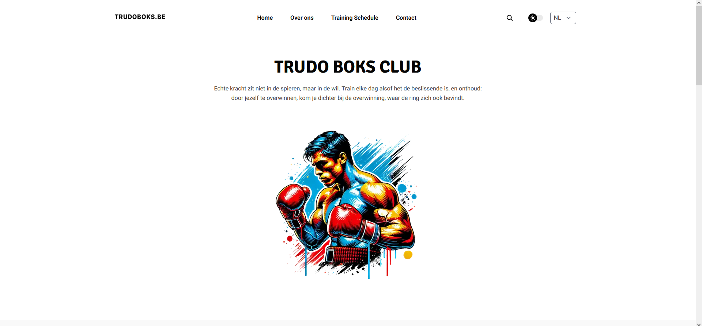
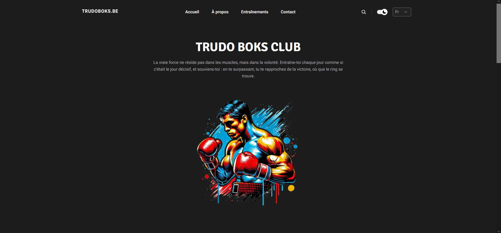
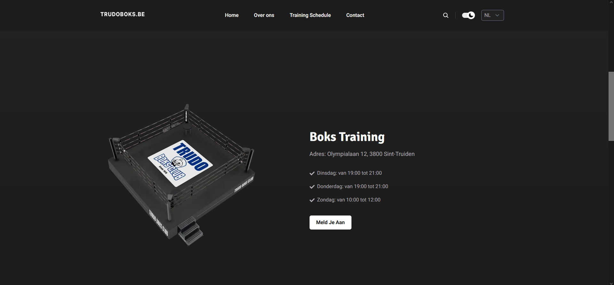
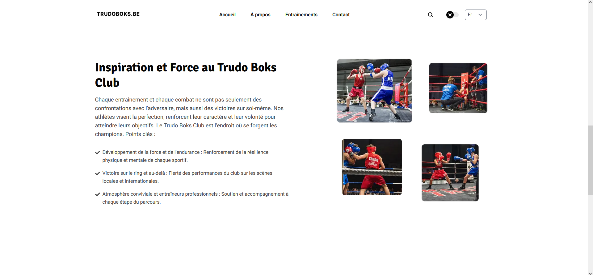
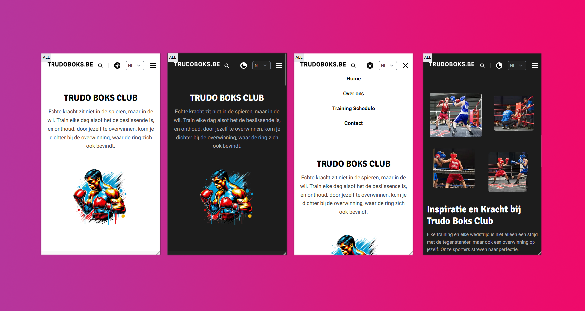

# 🥊 Trudo Boks Club Website

A professional website for **Trudo Boks Club**, a boxing sports club, developed using **Next.js** with the **Nextplate** template as a foundation. This project has been significantly customized to meet the needs of the club, featuring multilingual support, responsive design, and SEO optimization. The site will be deployed on **Netlify** with **EmailJS** handling form submissions, making it a fully serverless application.

## 🛠️ Technologies and Tools

- **Next.js** — React framework with SSR (server-side rendering) and static generation.
- **Nextplate** — a template for Next.js, serving as the base for this project.
- **Netlify** — deployment platform for serverless hosting.
- **EmailJS** — service for form submission handling without server logic.
- **SEO Optimization** — enhanced visibility for search engines.
- **Responsive Design** — supports multiple screen sizes and devices.
- **Multilingual Support** — available in Dutch and French.

## ✨ Key Features

- **📝 Registration and Contact Forms** — allows users to easily sign up for the club or contact coaches.
- **🌗 Theme Support** — light and dark theme toggle.
- **🌐 Multilingual Interface** — Dutch and French language support.
- **📱 Responsive Design** — optimized for desktop and mobile devices.

## 🔮 Future Enhancements

In the future, the site may be extended with:
- 🔐 A full backend for user management, news, and events.
- 🗓️ Event calendar and news feed.
- 📲 Advanced social media integration.
- ⚙️ Utilization of Netlify CMS for easier content management.

## 🚀 Installation and Setup

To run the project locally, follow these steps:

1. Clone the repository:
    ```bash
    git clone https://github.com/yourusername/trudo-boks-club.git
    ```

2. Navigate to the project directory:
    ```bash
    cd trudo-boks-club
    ```

3. Install dependencies with Yarn:
    ```bash
    yarn install
    ```

4. Start the local development server:
    ```bash
    yarn dev
    ```

The project will be available at [http://localhost:3000](http://localhost:3000).

## 📸 Screenshots

### 🖥️ Homepage (Desktop)



### ℹ️ About Us Section


### 📬 Contact and Registration Forms


### 📱 Mobile View (Dark and Light Themes)


## 🌍 Deployment on Netlify

The project is configured for deployment on [Netlify](https://www.netlify.com/), allowing for a serverless structure with access to Netlify Forms and other built-in features.

## 📧 Contact Forms with EmailJS

The website uses **EmailJS** for handling form submissions, including the registration and contact forms, allowing submissions without a dedicated backend.

## 🎬 Video

To view a short intro video with the club’s logo:
- **[YouTube Video](https://www.youtube.com/watch?v=7Q9r0WbYwF8)**

Or view the video embedded directly on the site:

```html
<video width="320" height="240" controls>
  <source src="./public/images/tbc-intro.mp4" type="video/mp4">
  Your browser does not support the video tag.
</video>
```
## 👤 Contact

**Developer:** Adam Gazdiev  
**LinkedIn:** [Follow me on LinkedIn](https://www.linkedin.com/in/adam-gazdiev/)


